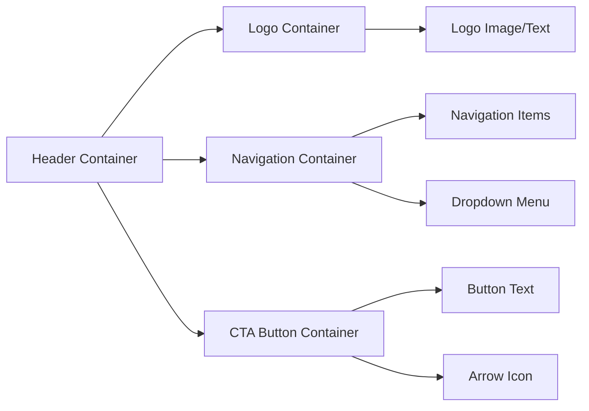
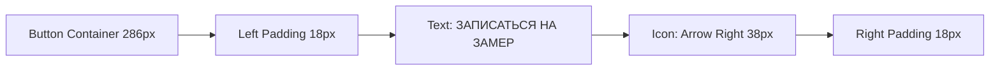
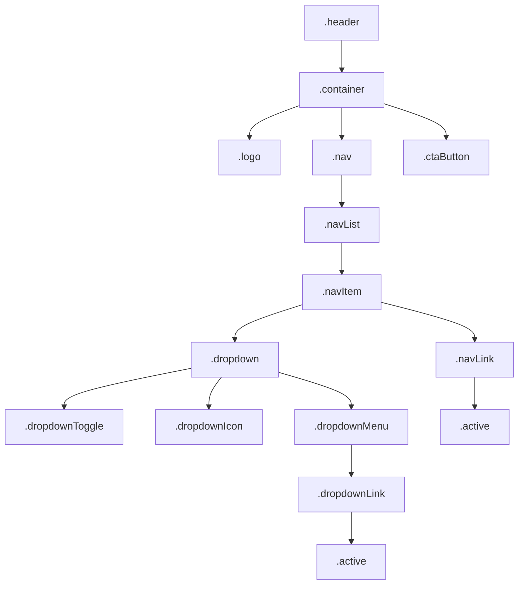
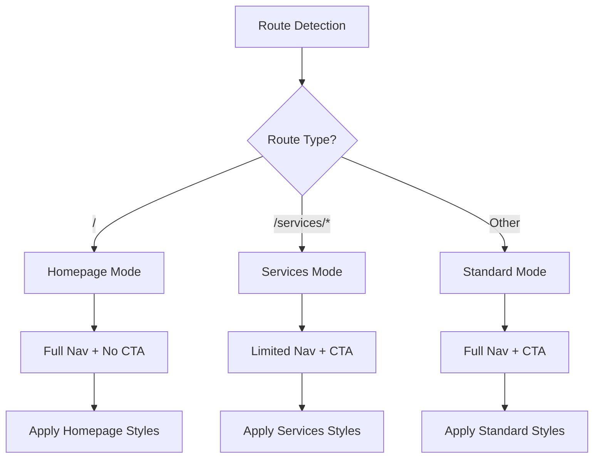

# Adaptive Header Styling Design

## 1. Overview

### Purpose
Style the existing Header component in three distinct display modes using CSS Modules (Header.module.css) to match the provided Figma design specifications.

### Scope
- Style desktop header layout with precise spacing based on Figma
- Implement three display modes: Homepage, Services pages, Other pages
- Apply conditional visibility for navigation items and CTA button
- Configure active state styling and dropdown positioning
- Maintain responsive behavior for mobile devices

### Target Pages
1. **Homepage Mode**: `/` (root)
2. **Services Mode**: `/services/ceilings`, `/services/walls`
3. **Standard Mode**: `/portfolio`, `/faq`, `/reviews`, `/contacts`, `/about`

## 2. Technology Stack

### Frontend Framework
- Next.js 15.5.5 with Pages Router
- React 19.1.0

### Styling Approach
- CSS Modules (Header.module.css)
- CSS Custom Properties from globals.css
- No external UI libraries

### Typography
- Font Family: Gilroy (Light, Regular, Medium)
- Font Size: 16px for navigation
- Font Weight: Variable based on state

## 3. Component Architecture

### Header Component Structure

The Header component consists of three main containers arranged horizontally:



### Container Hierarchy

| Container | Purpose | Visibility Rules |
|-----------|---------|-----------------|
| Logo Container | Displays site logo/branding | Always visible |
| Navigation Container | Holds menu items and dropdowns | Content varies by mode |
| CTA Button Container | Action button with icon | Hidden on homepage only |

### Navigation Item States

| State | Visual Treatment | Color Value |
|-------|-----------------|-------------|
| Default | Standard text color | #000000 (--color-text-primary) |
| Hover | Transition to brand color | Defined by interaction |
| Active | Brand accent color | #6D4C49 |
| Dropdown Open | Rotated icon indicator | Arrow rotates 180deg |

## 4. Display Mode Specifications

### Mode 1: Homepage Display

**Route Pattern**: `/` (exact match)

**Navigation Items Shown**:
- Главная
- Услуги (with dropdown: Потолки, Стены)
- Наши работы
- FAQ
- Отзывы
- Контакты

**Active Indicator**: "Главная"

**CTA Button**: Not displayed

**Container Dimensions**:
- Header Height: 90px
- Header Width: 897px (content width, not full viewport)
- Alignment: Left-aligned, not centered

**Spacing Details**:

| Element | Specification |
|---------|--------------|
| Logo left padding | 90px from container edge |
| Logo dimensions | Width: 94px, Height: 79px |
| Logo vertical padding | 5.5px top and bottom |
| Logo to navigation gap | 45px from logo right edge to navigation container |
| Navigation container | Width: 623px, Height: 90px |
| First item left padding | 10px from container left edge |
| Inter-item spacing | 40px between navigation items |
| Last item right padding | 30px from "Контакты" to container right edge |
| Navigation to edge | 45px from navigation container to right edge |

### Mode 2: Services Pages Display

**Route Patterns**: `/services/ceilings`, `/services/walls`

**Navigation Items Shown**:
- Главная
- Потолки
- Стены

**Dropdown Behavior**: Disabled (no "Услуги" dropdown)

**Active Indicator**: "Потолки" or "Стены" based on current route

**CTA Button**: Displayed

**Container Dimensions**:
- Header Height: 90px
- Header Width: 1480px

**Spacing Details**:

| Element | Specification |
|---------|--------------|
| Logo left padding | 90px |
| Logo dimensions | Width: 94px, Height: 79px |
| Logo vertical padding | 5.5px top and bottom |
| Logo to navigation gap | 45px |
| Navigation container | Width: 315px, Height: 90px |
| First item left padding | 10px |
| Inter-item spacing | 40px |
| Last item right padding | 30px |
| Navigation to CTA gap | 521px |
| CTA button dimensions | Width: 286px, Height: 44px |
| CTA button to edge | 149.5px from button right edge to container edge |

### Mode 3: Standard Pages Display

**Route Patterns**: `/portfolio`, `/faq`, `/reviews`, `/contacts`, `/about`

**Navigation Items Shown**:
- Главная
- Услуги (with dropdown: Потолки, Стены)
- Наши работы
- FAQ
- Отзывы
- Контакты

**Dropdown Behavior**: Enabled

**Active Indicator**: Highlights current page

**CTA Button**: Displayed

**Container Dimensions**:
- Header Height: 90px
- Header Width: 1480px

**Spacing Details**:

| Element | Specification |
|---------|--------------|
| Logo left padding | 90px |
| Logo dimensions | Width: 94px, Height: 79px |
| Logo vertical padding | 5.5px top and bottom |
| Logo to navigation gap | 45px |
| Navigation container | Width: 623px, Height: 90px |
| First item left padding | 10px |
| Inter-item spacing | 40px |
| Last item right padding | 30px |
| Navigation to CTA gap | 521px |
| CTA button dimensions | Width: 286px, Height: 44px |
| CTA button to edge | 149.5px |

## 5. CTA Button Styling

### Visual Design

**Display Condition**: Visible on all pages except homepage (`/`)

**Button Dimensions**:
- Width: 286px
- Height: 44px
- Border Radius: 20px
- Border: 1px solid #000

**Internal Layout**:

| Element | Specification |
|---------|--------------|
| Text | "ЗАПИСАТЬСЯ НА ЗАМЕР" (uppercase) |
| Font Size | 16px |
| Text Alignment | Centered within available space |
| Text left padding | 18px from button left edge |
| Arrow icon length | 38px |
| Arrow vertical alignment | Centered with text |
| Arrow right padding | 18px from button right edge to arrow end |

**Positional Layout**:

| Measurement | Value |
|-------------|-------|
| Vertical padding | 23px top and bottom |
| Right margin | 149.5px from container edge |
| Left gap (Services mode) | 521.5px from navigation group start |

### Button Content Structure



## 6. Dropdown Menu Styling

### Desktop Dropdown Behavior

**Trigger Element**: "Услуги" navigation item

**Child Items**:
- Потолки
- Стены

**Positioning Strategy**: Absolute positioning below parent item

**Visual Treatment**:

| Property | Value |
|----------|-------|
| Position | Absolute, below trigger |
| Background | White (#FFFFFF) |
| Shadow | Medium shadow for elevation |
| Border Radius | Medium (--radius-md) |
| Min Width | 200px |
| Padding | Small spacing (--spacing-sm) |

**Interaction States**:

| State | Behavior |
|-------|----------|
| Closed | Hidden, no DOM rendering or display:none |
| Open | Fade in animation, translateY from -8px |
| Hover Item | Background highlight with brand color |
| Active Item | Background color + brand color text |

**Icon Animation**: Dropdown arrow rotates 180deg when menu opens

## 7. Active State Styling

### Active Navigation Item

**Visual Indicator**:
- Color: #6D4C49 (brand accent color)
- Font Weight: Semibold (--font-weight-semibold)

**Active State Logic**:

| Route | Active Item |
|-------|-------------|
| `/` | "Главная" |
| `/services/ceilings` | "Потолки" |
| `/services/walls` | "Стены" |
| `/portfolio` | "Наши работы" |
| `/faq` | "FAQ" |
| `/reviews` | "Отзывы" |
| `/contacts` | "Контакты" |
| `/about` | "О нас" |

### Dropdown Active State

When on `/services/*` routes:
- Parent "Услуги" item shows active color on standard pages
- Direct child (Потолки/Стены) shows active color on services pages

## 8. Responsive Layout Strategy

### Desktop Layout (1024px+)

**Primary Target**: Desktop users at 1280px-1920px viewport width

**Layout Approach**:
- Fixed spacing values as specified
- Horizontal flexbox layout
- Logo, Navigation, CTA aligned in single row

### Tablet & Mobile Considerations

**Existing Mobile Implementation**: The Header.js component already includes mobile menu logic with hamburger toggle

**Mobile Styling Scope**: Not modified in this design task (existing mobile styles remain)

**Breakpoint**: 1024px (desktop styles apply above this threshold)

## 9. CSS Implementation Strategy

### CSS Module Class Structure



### Key CSS Classes

| Class Name | Purpose |
|------------|---------|
| `.header` | Main header container, sticky positioning |
| `.container` | Inner flex container for layout |
| `.logo` | Logo styling with fixed dimensions |
| `.nav` | Navigation wrapper, hidden on mobile |
| `.navList` | Flex container for nav items |
| `.navItem` | Individual navigation list item |
| `.navLink` | Link styling, active state support |
| `.dropdown` | Dropdown container with relative positioning |
| `.dropdownToggle` | Button to trigger dropdown |
| `.dropdownIcon` | Arrow icon with rotation animation |
| `.dropdownMenu` | Absolute positioned dropdown panel |
| `.dropdownLink` | Links within dropdown menu |
| `.ctaButton` | Call-to-action button with icon |
| `.active` | Active state modifier class |

### Spacing Variables Usage

The design uses precise pixel values rather than spacing variables due to Figma specifications:

| Spacing Value | Usage Context |
|--------------|---------------|
| 90px | Logo left padding, header height |
| 45px | Logo to navigation gap |
| 40px | Inter-item navigation spacing |
| 10px | First item left padding in nav container |
| 30px | Last item right padding in nav container |
| 521px | Navigation to CTA button gap |
| 149.5px | CTA button to container edge |
| 18px | CTA button internal text/icon padding |
| 23px | CTA button vertical padding |

### Color Variables Usage

| CSS Variable | Value | Usage |
|--------------|-------|-------|
| --color-text-primary | #000000 | Default navigation text |
| --color-text-tertiary | #6F3D3D | Active state color (Note: Design specifies #6D4C49) |
| --color-white | #FFFFFF | Dropdown background |

**Color Adjustment Required**: Active state should use #6D4C49 as specified in Figma, which differs slightly from existing --color-text-tertiary (#6F3D3D). This may require a new custom property or direct hex value.

## 10. Typography Specifications

### Navigation Text Styling

| Property | Value |
|----------|-------|
| Font Family | Gilroy-Regular |
| Font Size | 16px |
| Font Weight (default) | 400 (Regular) |
| Font Weight (active) | 600 (Semibold) |
| Text Color (default) | #000000 |
| Text Color (active) | #6D4C49 |
| Text Transform | None (as provided in content) |

### CTA Button Text Styling

| Property | Value |
|----------|-------|
| Font Family | Gilroy-Medium |
| Font Size | 16px |
| Font Weight | 500 (Medium) |
| Text Color | #000000 |
| Text Transform | Uppercase |
| Letter Spacing | Normal |

### Dropdown Text Styling

| Property | Value |
|----------|-------|
| Font Family | Gilroy-Regular |
| Font Size | 16px |
| Font Weight (default) | 400 |
| Font Weight (active/hover) | 500 |
| Text Color | #000000 |

## 11. Navigation Vertical Alignment

### Text Vertical Padding

**Specification**: 35.5px padding top and bottom for navigation text

This creates the visual vertical centering within the 90px header height:
- Total vertical padding: 71px (35.5px × 2)
- Remaining space for text: 19px (approximately line height)

### Logo Vertical Alignment

**Specification**: 5.5px padding top and bottom

Logo alignment calculation:
- Logo height: 79px
- Top padding: 5.5px
- Bottom padding: 5.5px
- Total: 90px (matches header height exactly)

## 12. Conditional Rendering Logic

### Navigation Item Visibility

The Header.js component must apply conditional class names or data attributes to control visibility:

**Homepage Mode**:
- All full navigation items visible
- "О нас" item may need to be hidden based on navItems array

**Services Mode**:
- Filter to show only: Главная, Потолки, Стены
- Hide all other navigation items
- Disable dropdown functionality

**Standard Mode**:
- Show all navigation items
- Enable dropdown functionality

### CTA Button Visibility

**Condition**: `router.pathname !== '/'`

**Implementation Approach**:
- CSS display property controlled via conditional class
- Or inline style based on route check
- Hide completely on homepage, show on all other pages

### Implementation Pattern



## 13. Testing Specifications

### Visual Regression Testing

**Test Scenarios**:

| Scenario | Validation Points |
|----------|------------------|
| Homepage display | Logo spacing, full navigation, no CTA button |
| Services/Ceilings page | Limited nav, "Потолки" active, CTA visible |
| Services/Walls page | Limited nav, "Стены" active, CTA visible |
| Portfolio page | Full nav, "Наши работы" active, CTA visible |
| FAQ page | Full nav, "FAQ" active, CTA visible |
| Reviews page | Full nav, "Отзывы" active, CTA visible |
| Contacts page | Full nav, "Контакты" active, CTA visible |

### Interaction Testing

**Dropdown Behavior**:
- Click "Услуги" opens dropdown menu
- Dropdown displays "Потолки" and "Стены" links
- Click outside closes dropdown
- Escape key closes dropdown
- Dropdown only functional on homepage and standard pages

**Active State Verification**:
- Each page highlights correct navigation item
- Active color #6D4C49 applied correctly
- Font weight changes to semibold on active items

**Button Functionality**:
- CTA button links to phone number
- Button displays correctly on all non-homepage routes
- Button hidden completely on homepage

### Spacing Verification

**Measurement Points**:
- Logo left padding: 90px
- Logo to navigation: 45px
- Navigation item gaps: 40px
- Navigation to CTA: 521px
- CTA to container edge: 149.5px
- CTA internal padding: 18px left and right
- Header height: 90px
- Navigation vertical padding: 35.5px top/bottom

### Cross-Browser Testing

**Target Browsers**:
- Chrome (latest)
- Firefox (latest)
- Safari (latest)
- Edge (latest)

**Validation Points**:
- Flexbox layout renders consistently
- Font rendering matches design
- Spacing calculations accurate across browsers
- Dropdown positioning correct
- Active states apply uniformly

## 14. Design Assets Requirements

### Logo Asset

**Source**: Existing logo component in Header.js uses text "СтретчПотолки"

**Potential Update**: Replace with actual logo image if provided in Figma

**Specifications**:
- Width: 94px
- Height: 79px
- Format: SVG (recommended) or PNG with @2x for retina
- Placement: Left-aligned with 90px padding

### Arrow Icon for CTA Button

**Type**: Right-pointing arrow

**Dimensions**: 38px length (width)

**Color**: #000000 (black)

**Format**: Inline SVG recommended for styling flexibility

**Example SVG Structure**:
```
SVG arrow with viewBox for 38px width
Stroke or fill: currentColor for inheritance
Centered vertically with text
```

### Dropdown Arrow Icon

**Current Implementation**: Already exists in Header.js

**Animation**: Rotate 180deg on dropdown open

**Dimensions**: 12px × 8px (as defined in existing code)

**Behavior**: Visual indicator of dropdown state

## 15. Accessibility Considerations

### Keyboard Navigation

**Tab Order**:
1. Logo (link to home)
2. Navigation items (left to right)
3. Dropdown toggle (if present)
4. Dropdown items (when open)
5. CTA button (if visible)

**Keyboard Interactions**:

| Key | Action |
|-----|--------|
| Tab | Move focus through header elements |
| Enter/Space | Activate links and buttons |
| Escape | Close dropdown menu |
| Arrow Down | Navigate dropdown items (optional enhancement) |

### ARIA Attributes

**Existing Implementation** (from Header.js):

| Element | ARIA Attribute | Purpose |
|---------|---------------|---------|
| Navigation | `aria-label="Основная навигация"` | Identifies main nav |
| Dropdown Toggle | `aria-expanded` | Indicates dropdown state |
| Dropdown Toggle | `aria-haspopup="true"` | Indicates submenu presence |
| Dropdown Icon | `aria-hidden="true"` | Hides decorative icon |

### Focus Management

**Focus Visible Styles**: Utilize global `:focus-visible` styles from globals.css

**Focus Indicators**:
- 2px outline in primary color
- 2px offset for clarity
- Applied to all interactive elements

### Screen Reader Support

**Announcements**:
- Current page indicated by active state
- Dropdown state changes announced
- Link purposes clearly communicated

## 16. Performance Considerations

### CSS Optimization

**File Size**: Minimal impact as styles added to existing CSS Module

**Specificity**: Use single class selectors to avoid specificity conflicts

**Unused Styles**: Remove or update any conflicting legacy styles

### Rendering Performance

**Layout Shifts**: Fixed header height (90px) prevents CLS

**Repaints**: Minimize by using transform for animations

**GPU Acceleration**: Dropdown animations use transform for smoothness

### Asset Loading

**Logo**: Optimize image file size if replacing text with image

**Icons**: Use inline SVG for CTA arrow to avoid HTTP requests

**Font Loading**: Gilroy fonts already loaded globally via font-face declarations