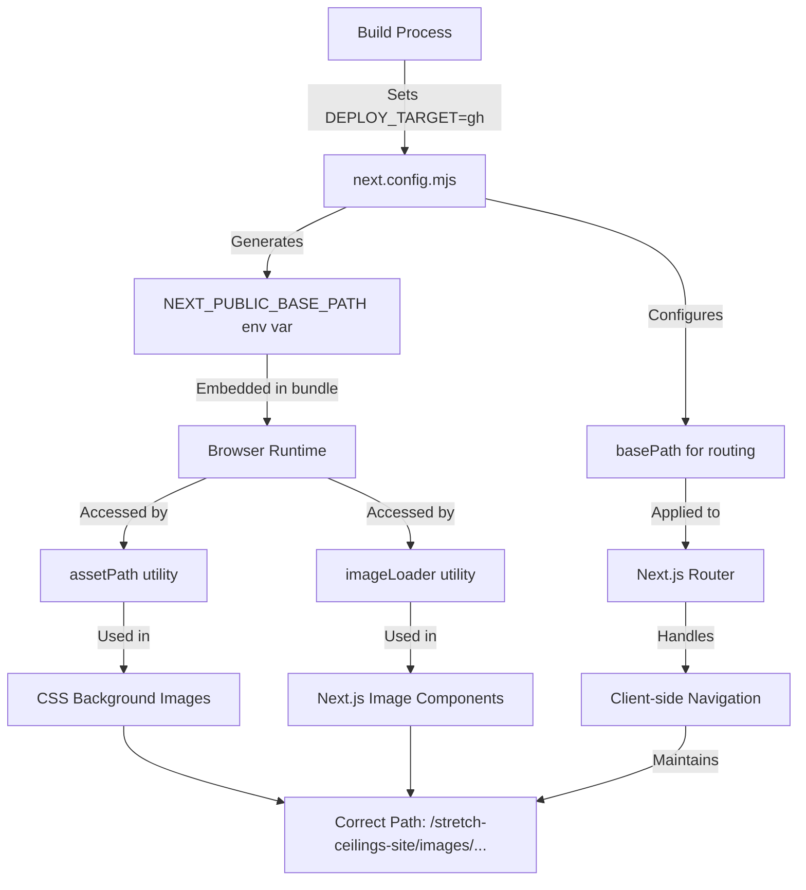

# GitHub Pages Image Path Fix

## Overview

This design addresses the critical issue of incorrect image paths when the Next.js application is deployed to GitHub Pages. The root problem is that images are loading with relative paths (e.g., `/images/index/hero_main.png`) instead of absolute paths with the correct base path (e.g., `https://soldatova-kristina.github.io/stretch-ceilings-site/images/index/hero_main.png`). This causes images to fail loading both on initial page load and when navigating between pages via client-side routing.

**Target URL**: https://soldatova-kristina.github.io/stretch-ceilings-site/

**Repository Type**: Frontend Application (Next.js with Static Export)

**Current Issue**: Images fail to load because the base path `/stretch-ceilings-site` is not being properly prepended to image URLs in the static export, particularly when using Next.js Image component and CSS background images.

## Root Cause Analysis

### Identified Problems

| Issue Category | Current State | Impact |
|---|---|---|
| **Runtime Base Path Resolution** | `assetPath.js` and `imageLoader.js` import `BASE_PATH` from `next.config.mjs`, but this is a **build-time constant**, not available at **runtime** in static exports | Image paths are not correctly resolved during client-side navigation |
| **Next.js Image Component** | Custom loader attempts to use build-time `BASE_PATH` which is `undefined` at runtime in browser | Next.js `<Image>` components fail to generate correct paths |
| **CSS Background Images** | CSS uses JavaScript template literals with `assetPath()` function that relies on unavailable build-time constant | Background images in styles fail to load |
| **Static Export Limitation** | Next.js static export (`output: 'export'`) doesn't inject environment variables into client bundle automatically | Runtime environment variables are unavailable |
| **Deployment Script** | Current `deploy:gh` script has redundant directory copying that may cause confusion | Not directly causing image issues but adds complexity |

### Technical Explanation

When Next.js builds with `output: 'export'`:
1. The `basePath` configuration affects routing and automatic asset prefixing for static assets in `_next/static/`
2. However, **custom code** (like `assetPath.js`, `imageLoader.js`) that imports from `next.config.mjs` receives the value at **build time** on the server
3. In the browser, after static export, there is **no access** to `next.config.mjs` - it's a Node.js module
4. The `NEXT_PUBLIC_BASE_PATH` environment variable is set but needs to be accessed correctly in the browser

### Why Current Solution Fails

```
Current Flow:
1. Build: DEPLOY_TARGET=gh → basePath = '/stretch-ceilings-site'
2. Build exports static HTML/JS with basePath in routing
3. Browser loads page: assetPath() tries to import BASE_PATH from next.config.mjs
4. Browser has no access to next.config.mjs → BASE_PATH is undefined
5. Image paths become '/images/...' instead of '/stretch-ceilings-site/images/...'
```

## Solution Strategy

The solution involves shifting from **build-time imports** to **runtime environment variable access** using Next.js's built-in `process.env.NEXT_PUBLIC_BASE_PATH` which is properly embedded into the client bundle during build.

### Design Principles

1. **Runtime Environment Variables**: Use `NEXT_PUBLIC_*` prefixed environment variables which Next.js automatically inlines into the browser bundle
2. **Consistent Path Resolution**: Create a single source of truth for path resolution that works identically on initial load and client-side navigation
3. **No Build-Time Dependencies**: Eliminate imports from `next.config.mjs` in client-side utility functions
4. **Framework Compliance**: Work with Next.js static export limitations rather than against them
5. **Backward Compatibility**: Ensure solution works for both GitHub Pages and Timeweb deployments

## Architecture Changes

### Component Interaction Flow



### Data Flow

| Stage | Component | Input | Processing | Output |
|---|---|---|---|---|
| **Build Time** | next.config.mjs | DEPLOY_TARGET env var | Determine basePath value | Sets basePath config + NEXT_PUBLIC_BASE_PATH |
| **Build Time** | Next.js Builder | basePath config | Apply to routing and _next/static | Static HTML/JS with correct routing |
| **Runtime** | assetPath.js | Image path string | Read process.env.NEXT_PUBLIC_BASE_PATH + prepend to path | Full path with base |
| **Runtime** | imageLoader.js | Next.js src prop | Read process.env.NEXT_PUBLIC_BASE_PATH + prepend to src | Full path with base |
| **Runtime** | Components | Image paths | Call assetPath/use Image with loader | Correct URLs in browser |

## Technical Design

### Modified Utility Functions

#### assetPath.js Redesign

**Purpose**: Generate correct asset paths for CSS background images, static assets, and links

**Current Issues**:
- Imports `BASE_PATH` from `next.config.mjs` (not available at runtime)
- Unreliable in browser context

**New Design**:
- Read `process.env.NEXT_PUBLIC_BASE_PATH` directly
- No imports from configuration files
- Pure runtime resolution

**Behavior Specification**:

| Input Path | NEXT_PUBLIC_BASE_PATH | Output |
|---|---|---|
| `/images/hero.png` | `/stretch-ceilings-site` | `/stretch-ceilings-site/images/hero.png` |
| `/images/hero.png` | `` (empty) | `/images/hero.png` |
| `images/hero.png` | `/stretch-ceilings-site` | `/stretch-ceilings-site/images/hero.png` |
| `https://example.com/image.png` | `/stretch-ceilings-site` | `https://example.com/image.png` (unchanged) |
| `http://example.com/image.png` | `/stretch-ceilings-site` | `http://example.com/image.png` (unchanged) |
| `` (empty) | `/stretch-ceilings-site` | `` (empty) |

**Algorithm**:
1. Retrieve base path from `process.env.NEXT_PUBLIC_BASE_PATH`, default to empty string
2. If input path is empty, return empty string
3. If input path is absolute URL (starts with http:// or https://), return unchanged
4. Normalize input path to start with `/`
5. Concatenate base path with normalized path
6. Return result

#### imageLoader.js Redesign

**Purpose**: Custom loader for Next.js Image component to prepend base path

**Current Issues**:
- Imports `BASE_PATH` from `next.config.mjs` (not available at runtime)
- Causes Image component to generate incorrect src URLs

**New Design**:
- Read `process.env.NEXT_PUBLIC_BASE_PATH` directly
- Handle edge cases (already prefixed paths, external URLs)
- No configuration imports

**Behavior Specification**:

| Input src | NEXT_PUBLIC_BASE_PATH | Output |
|---|---|---|
| `/images/hero.png` | `/stretch-ceilings-site` | `/stretch-ceilings-site/images/hero.png` |
| `images/hero.png` | `/stretch-ceilings-site` | `/stretch-ceilings-site/images/hero.png` |
| `/stretch-ceilings-site/images/hero.png` | `/stretch-ceilings-site` | `/stretch-ceilings-site/images/hero.png` (no double prefix) |
| `https://cdn.example.com/image.png` | `/stretch-ceilings-site` | `https://cdn.example.com/image.png` (unchanged) |
| `` (empty) | `/stretch-ceilings-site` | `` (empty) |

**Algorithm**:
1. Retrieve base path from `process.env.NEXT_PUBLIC_BASE_PATH`, default to empty string
2. If src is empty, return empty string
3. If src is absolute URL (starts with http:// or https://), return unchanged
4. If base path exists and src already starts with `basePath + '/'`, return src unchanged (avoid double-prefixing)
5. Normalize src to start with `/`
6. Concatenate base path with normalized src
7. Return result

### Configuration Enhancements

#### next.config.mjs Clarifications

**Current Configuration**:
- Correctly sets `basePath` based on deployment target
- Sets `NEXT_PUBLIC_BASE_PATH` in env object
- Uses `output: 'export'` for static generation
- Configures custom image loader

**Required Validation**:
- Ensure `NEXT_PUBLIC_BASE_PATH` is consistently set to match `basePath`
- Verify `assetPrefix` matches `basePath` for static assets
- Confirm `unoptimized: true` is set for Image component (required for static export)

**No Changes Required** - configuration is already correct, the issue is in utility function implementation

### Deployment Process Improvements

#### Current GitHub Pages Deployment

**Via GitHub Actions** (`.github/workflows/deploy.yml`):
1. Checkout code
2. Install dependencies
3. Run `npm run build:gh` (sets DEPLOY_TARGET=gh)
4. Add `.nojekyll` file
5. Upload `./out` directory
6. Deploy via GitHub Pages action

**Status**: Working correctly, no changes needed

#### Alternative Manual Deployment

The `deploy:gh` npm script has unnecessary complexity:
- Creates redundant nested directory structure
- Copies files multiple times

**Recommended Simplification** (not critical, but cleaner):
```
Old behavior: Creates out/stretch-ceilings-site/stretch-ceilings-site/...
Simpler approach: Deploy out/ directory directly (like GitHub Actions does)
```

**Note**: Since GitHub Actions workflow is the primary deployment method and works correctly, the npm script is less critical but should be simplified for consistency.

## Implementation Scope

### Files to Modify

| File Path | Modification Type | Purpose |
|---|---|---|
| `/utils/assetPath.js` | Refactor | Replace BASE_PATH import with process.env.NEXT_PUBLIC_BASE_PATH |
| `/utils/imageLoader.js` | Refactor | Replace BASE_PATH import with process.env.NEXT_PUBLIC_BASE_PATH |

### Files to Verify (No Changes)

| File Path | Verification |
|---|---|
| `/next.config.mjs` | Confirm NEXT_PUBLIC_BASE_PATH is set correctly |
| `/pages/_app.js` | Verify CSS variable setting (informational only, not affecting images) |
| `/components/**/*.js` | Confirm Image components use src prop correctly (no hardcoded base paths) |
| `/data/**/*.js` | Confirm image paths start with `/images/...` (no base path prefix) |

## Expected Behavior After Fix

### Initial Page Load

| Scenario | Expected Outcome |
|---|---|
| User visits https://soldatova-kristina.github.io/stretch-ceilings-site/ | All images load with correct paths including /stretch-ceilings-site prefix |
| Hero image via Next.js Image | Loads from /stretch-ceilings-site/images/index/hero_main.png |
| CSS background images | Load with correct base path prefix |
| Portfolio images | All images in sliders load correctly |

### Client-Side Navigation

| Scenario | Expected Outcome |
|---|---|
| User clicks navigation link to /portfolio | Page transitions smoothly, all portfolio images load immediately |
| User navigates to /services/ceilings | Service page images load without page refresh |
| User uses browser back button | Previous page images remain cached and display instantly |
| User directly visits deep link | Images load correctly even on non-home pages |

### Cross-Environment Consistency

| Environment | Base Path | Expected Behavior |
|---|---|---|
| GitHub Pages | `/stretch-ceilings-site` | All images prefixed with base path |
| Timeweb Root | `` (empty) | Images use root-relative paths (no prefix) |
| Timeweb Subpath | `/custom-path` (if set) | Images prefixed with custom base path |
| Local Development | `` (empty) | Images load from root (no prefix) |

## Testing Strategy

### Test Cases

| Test ID | Test Description | Verification Method |
|---|---|---|
| TC-01 | Initial page load on GitHub Pages | Visit https://soldatova-kristina.github.io/stretch-ceilings-site/ and verify all images visible |
| TC-02 | Hero section image | Inspect Network tab, confirm hero_main.png loads from correct path |
| TC-03 | Portfolio page navigation | Click to /portfolio, verify images load without refresh |
| TC-04 | Background images | Inspect CSS, confirm background images have correct URLs |
| TC-05 | Direct deep link | Visit https://soldatova-kristina.github.io/stretch-ceilings-site/reviews/ directly, verify images |
| TC-06 | Browser back/forward | Navigate between pages using browser controls, verify no image reloading |
| TC-07 | Image slider functionality | Test portfolio image sliders work correctly |
| TC-08 | Local development | Run `npm run dev`, verify images load without base path |
| TC-09 | Timeweb deployment simulation | Build with `npm run build:timeweb`, verify no base path |

### Validation Checklist

**Pre-deployment Validation**:
- [ ] Build completes without errors: `npm run build:gh`
- [ ] Output directory contains expected structure: `out/` has all pages
- [ ] Static assets copied correctly: `out/images/` contains all images
- [ ] HTML inspection: Generated HTML has correct src attributes
- [ ] JavaScript bundle: Verify NEXT_PUBLIC_BASE_PATH is inlined in bundle

**Post-deployment Validation**:
- [ ] Home page loads all images
- [ ] Navigation to all pages works without image loading issues
- [ ] Browser console shows no 404 errors for images
- [ ] Network tab shows all image requests resolve successfully
- [ ] Mobile responsive images load correctly
- [ ] Lazy-loaded images appear when scrolled into view

### Browser Testing Matrix

| Browser | Version | Test Scope |
|---|---|---|
| Chrome | Latest | Full testing - initial load, navigation, caching |
| Firefox | Latest | Full testing - initial load, navigation, caching |
| Safari | Latest | Full testing - iOS compatibility |
| Edge | Latest | Basic testing - initial load, navigation |
| Mobile Safari | iOS 15+ | Mobile-specific testing |
| Chrome Mobile | Android Latest | Mobile-specific testing |

## Risk Assessment

| Risk | Probability | Impact | Mitigation |
|---|---|---|---|
| Environment variable not embedded in bundle | Low | High | Next.js automatically inlines NEXT_PUBLIC_* vars; verify build output |
| Breaking Timeweb deployment | Low | Medium | NEXT_PUBLIC_BASE_PATH defaults to empty string; test both environments |
| Cached old bundle in browser | Medium | Low | Users may need hard refresh; add cache busting via version if needed |
| External image URLs accidentally prefixed | Low | Low | Utility functions check for http/https prefix; test with external images |
| Double-prefixing on subsequent builds | Low | Medium | imageLoader checks for existing prefix; add test case |

## Migration Path

### Deployment Sequence

``mermaid
sequenceDiagram
    participant Dev as Developer
    participant Git as Git Repository
    participant GH as GitHub Actions
    participant Pages as GitHub Pages
    participant User as End User

    Dev->>Dev: Modify assetPath.js
    Dev->>Dev: Modify imageLoader.js
    Dev->>Dev: Run local tests
    Dev->>Git: Commit changes to main branch
    Git->>GH: Trigger workflow on push
    GH->>GH: Checkout code
    GH->>GH: npm install
    GH->>GH: npm run build:gh (DEPLOY_TARGET=gh)
    GH->>GH: Add .nojekyll
    GH->>GH: Upload artifact
    GH->>Pages: Deploy artifact
    Pages->>User: Serve updated site
    User->>Pages: Request page
    Pages->>User: Return HTML with correct image paths
    User->>Pages: Request images
    Pages->>User: Serve images successfully
```

### Rollback Strategy

If issues occur after deployment:

1. **Immediate Rollback**: 
   - Revert commits in main branch
   - GitHub Actions will automatically redeploy previous working version
   
2. **Debugging Approach**:
   - Check GitHub Actions build logs for errors
   - Download build artifact and inspect locally
   - Verify environment variable values in build output
   
3. **Hotfix Process**:
   - Create fix in local environment
   - Test thoroughly with `npm run build:gh`
   - Push to main for automatic deployment

## Browser Compatibility Considerations

### Process.env Access

- `process.env.NEXT_PUBLIC_BASE_PATH` is replaced at **build time** by Next.js
- The actual runtime code contains the literal string value, not a process.env lookup
- No runtime environment access is required
- Compatible with all browsers (no special APIs needed)

### CSS Background Images

- Modern CSS variables used in `_app.js` for potential future use
- Background images set via inline styles with JavaScript template literals
- Compatible with all modern browsers (ES6+ required for template literals)

### Next.js Image Component

- Uses custom loader function
- Generates standard `` tags with correct src attributes
- No special browser requirements beyond basic image loading

## Performance Implications

### Build Time

| Aspect | Impact | Notes |
|---|---|---|
| Build duration | No change | Utility function changes don't affect build time |
| Bundle size | Negligible (-100 bytes) | Removing one import slightly reduces bundle |
| Static generation | No change | Same number of pages generated |

### Runtime Performance

| Aspect | Impact | Notes |
|---|---|---|
| Image loading speed | **Improved** | Images now load correctly instead of failing |
| Client-side navigation | **Improved** | No forced page reloads, smooth transitions |
| Cache utilization | **Improved** | Images cached properly, reused across navigation |
| JavaScript execution | No change | Minimal string concatenation overhead |

## Security Considerations

### Path Traversal Protection

Both utility functions should validate inputs to prevent path traversal attacks:

- **Already Protected**: Functions check for absolute URLs and return them unchanged
- **Already Protected**: Base path is controlled via environment variable set at build time
- **Additional Validation**: Not required as all paths are developer-controlled (from data files)

### Content Security Policy

- Images served from same origin (GitHub Pages domain)
- No external image sources in current implementation
- CSP headers can remain strict (no modifications needed)

## Accessibility Impact

This fix has **positive accessibility impact**:

- **Screen Readers**: Previously broken images had missing alt text context; now images load and alt text is properly associated
- **Low Bandwidth Users**: Correct paths mean no wasted requests to 404 errors
- **Keyboard Navigation**: Image-based navigation elements (if any) now function correctly

No new accessibility concerns introduced.

## Future Enhancements

| Enhancement | Priority | Description |
|---|---|---|
| Image Optimization | Medium | Consider Next.js Image Optimization API or external service for better performance |
| WebP Support | Low | Already using WebP via scripts; ensure paths work correctly |
| Responsive Images | Low | Verify srcset generation works with base path |
| CDN Integration | Low | If moving to CDN, update assetPath to support CDN URLs |
| Environment Indicator | Low | Add visual indicator in development vs production environments |

## References

### Next.js Documentation

- [Static Exports](https://nextjs.org/docs/app/building-your-application/deploying/static-exports)
- [Environment Variables](https://nextjs.org/docs/pages/building-your-application/configuring/environment-variables)
- [basePath Configuration](https://nextjs.org/docs/app/api-reference/next-config-js/basePath)
- [Image Component](https://nextjs.org/docs/pages/api-reference/components/image)

### GitHub Pages

- [Deployment Guide](https://docs.github.com/en/pages/getting-started-with-github-pages)
- [Custom Domains](https://docs.github.com/en/pages/configuring-a-custom-domain-for-your-github-pages-site)

### Build Environment

- Node.js version: 18.x (as per GitHub Actions workflow)
- Next.js version: 15.5.5 (as per package.json)
- React version: 19.1.0 (as per package.json)
