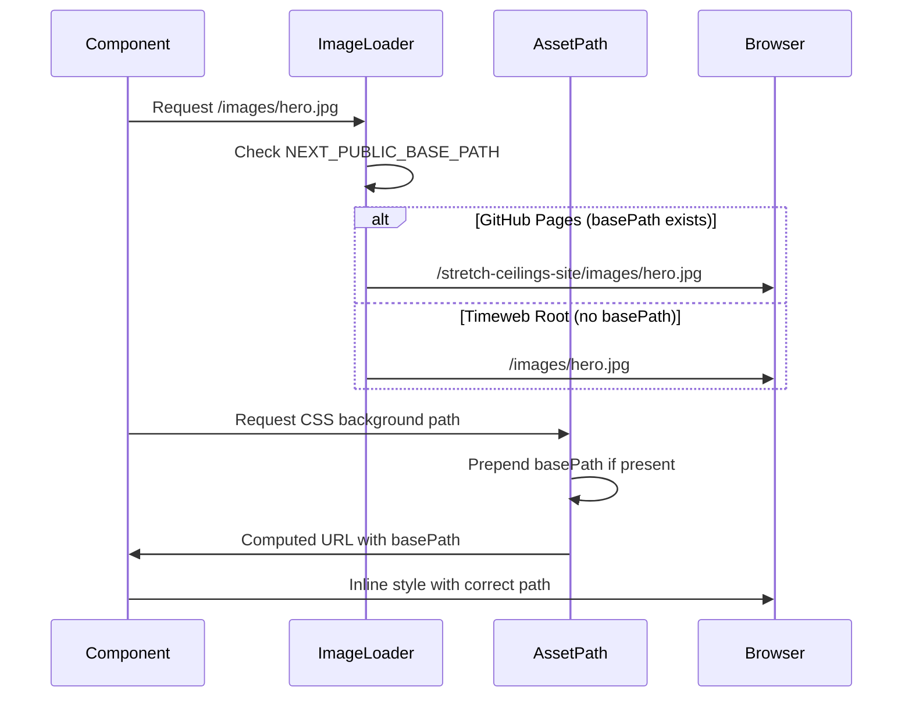

# Image Fixation and WebP Migration Design

## Overview

This design addresses critical asset delivery issues and performance optimization for a Next.js 15 static site deployed to dual hosting environments: GitHub Pages (with subpath `/stretch-ceilings-site`) and Timeweb Static (root domain or custom subpath). The solution ensures zero image 404 errors across both platforms while implementing safe WebP migration without layout regressions.

### Business Value

- **Reliability**: Eliminate broken images on GitHub Pages deployment
- **Performance**: Reduce bandwidth by 20-40% through WebP adoption without visual quality loss
- **Multi-Platform Delivery**: Seamless deployment to both GitHub Pages and Timeweb Static with environment-specific path resolution
- **User Experience**: Maintain pixel-perfect layout integrity and accessibility compliance during format migration

### Current Problems

1. **Path Resolution Failures**: Images fail to load on GitHub Pages due to absolute CSS paths (`url('/images/...')`) not accounting for basePath prefix
2. **Layout Instability**: Previous WebP conversion attempts caused dimension mismatches and CLS (Cumulative Layout Shift) violations
3. **Configuration Ambiguity**: Single configuration cannot handle both GitHub Pages subpath and Timeweb root deployment
4. **Before/After Component**: Lacks accessibility features and optimal UX patterns for comparison slider

## Architecture

### Deployment Environment Strategy

The system supports two distinct hosting environments with conditional configuration:

| Aspect | GitHub Pages | Timeweb Static |
|--------|-------------|----------------|
| **Base Path** | `/stretch-ceilings-site` | `` (empty for root) or custom via `BASE_PATH` |
| **Asset Prefix** | `/stretch-ceilings-site/` (with trailing slash) | `` or custom `BASE_PATH/` |
| **Trigger Variable** | `DEPLOY_TARGET=gh` | `BASE_PATH` environment variable |
| **Output Directory** | `out/` | `out/` |
| **URL Example** | `https://user.github.io/stretch-ceilings-site/images/hero.webp` | `https://domain.com/images/hero.webp` |

### Path Resolution Architecture

``mermaid
graph TD
    A[Build Process] --> B{Environment Detection}
    B -->|DEPLOY_TARGET=gh| C[GitHub Pages Mode]
    B -->|BASE_PATH set| D[Timeweb Subpath Mode]
    B -->|Neither set| E[Timeweb Root Mode]
    
    C --> F[basePath: /stretch-ceilings-site]
    D --> G[basePath: BASE_PATH value]
    E --> H[basePath: empty string]
    
    F --> I[Export NEXT_PUBLIC_BASE_PATH]
    G --> I
    H --> I
    
    I --> J[Client-Side Path Resolution]
    J --> K[imageLoader.js]
    J --> L[assetPath.js]
    J --> M[CSS Background Injection]
    
    K --> N[Image Component Paths]
    L --> N
    M --> O[Inline Style Paths]
```

### Asset Path Resolution Flow



## Configuration Design

### Next.js Configuration Schema

The `next.config.mjs` file structure for environment-aware builds:

| Parameter | Purpose | GitHub Pages Value | Timeweb Root Value | Timeweb Subpath Value |
|-----------|---------|-------------------|-------------------|----------------------|
| `output` | Enable static export | `'export'` | `'export'` | `'export'` |
| `basePath` | URL path prefix | `/stretch-ceilings-site` | `` | `process.env.BASE_PATH` |
| `assetPrefix` | Asset URL prefix | `/stretch-ceilings-site/` | `` | `${process.env.BASE_PATH}/` |
| `trailingSlash` | Directory compatibility | `true` | `true` | `true` |
| `images.unoptimized` | Disable server optimization | `true` | `true` | `true` |
| `images.loader` | Custom path handler | `'custom'` | `'custom'` | `'custom'` |
| `images.loaderFile` | Loader implementation | `'./utils/imageLoader.js'` | `'./utils/imageLoader.js'` | `'./utils/imageLoader.js'` |
| `env.NEXT_PUBLIC_BASE_PATH` | Client-accessible variable | `basePath` value | `` | `BASE_PATH` value |

### Environment Variable Strategy

**Build-time variables:**

- `NODE_ENV`: Always `production` for both platforms
- `DEPLOY_TARGET`: Set to `gh` specifically for GitHub Pages builds
- `BASE_PATH`: Optional custom subpath for Timeweb deployments

**Runtime-accessible variables:**

- `NEXT_PUBLIC_BASE_PATH`: Exported from build config, accessible in client components via `process.env.NEXT_PUBLIC_BASE_PATH`

### Configuration Logic Flow

``mermaid
flowchart TD
    Start[Build Start] --> CheckTarget{DEPLOY_TARGET === 'gh'?}
    CheckTarget -->|Yes| GHePath = /stretch-ceilings-site]
    CheckTarget -->|No| CheckBase{BASE_PATH defined?}
    
    CheckBase -->|Yes| Custom[basePath = BASE_PATH]
    CheckBase -->|No| Root[basePath = '']
    
    GH --> Export[Export NEXT_PUBLIC_BASE_PATH]
    Custom --> Export
    Root --> Export
    
    Export --> Apply[Apply to config]
    Apply --> Build[Static Build]
    Build --> Output[Generate out/ directory]
```

## Image Path Resolution Strategy

### Current Path Issues

The existing codebase contains 12 instances of absolute CSS paths that fail on GitHub Pages:

| File | Pattern | Issue |
|------|---------|-------|
| `FinishingComparison.module.css` | `url('/images/texture/white_texture.jpg')` | Resolves to root, ignores basePath |
| `Footer.module.css` (2 instances) | `url('/images/texture/white_texture.jpg')` | Same issue |
| `Header.module.css` (3 instances) | `url('/images/texture/...')` | Same issue |
| `HeroSection.module.css` (2 instances) | `url('/images/texture/...')` | Same issue |
| `StepsAccordion.module.css` | `url('/images/texture/white_texture.jpg')` | Same issue |
| `contacts.module.css` | `url('/images/texture/black_djins.png')` | Same issue |
| `faq.module.css` | `url('/images/texture/faq_background.jpg')` | Same issue |
| `portfolio.module.css` | `url('/images/texture/white_texture.jpg')` | Same issue |

### Path Resolution Approaches

Three valid approaches for different use cases:

#### Approach 1: Inline Style Injection (Recommended for backgrounds)

**When to use:** CSS background images requiring basePath awareness

**Implementation pattern:**
```
// Component receives backgroundImage as prop
<div style={{ backgroundImage: `url(${assetPath('images/hero.jpg')})` }} />
```

**Advantages:**
- Full control over path construction
- Works with assetPath utility
- No post-build script dependency

**Disadvantages:**
- Cannot use CSS pseudo-elements for backgrounds
- Slight increase in HTML size

#### Approach 2: Post-Build CSS Rewriting (Current approach)

**When to use:** Existing CSS modules with many hardcoded paths

**Implementation:** `scripts/fix-css-paths.mjs` runs after build to replace absolute paths

**Advantages:**
- No component changes required
- Handles all CSS files automatically

**Disadvantages:**
- Build step dependency
- Doesn't prevent future absolute paths
- Adds build time

#### Approach 3: Relative CSS Paths

**When to use:** CSS modules co-located with components

**Implementation pattern:**
``css
/* Component.module.css */
.background {
  background-image: url('../../public/images/hero.jpg');
}
```

**Advantages:**
- No runtime path resolution
- No post-build processing

**Disadvantages:**
- Only works for file-relative paths
- Doesn't work for public/ assets in Next.js

### Recommended Migration Path

| Asset Type | Approach | Reason |
|------------|----------|--------|
| Component backgrounds | Inline style injection | Full basePath control, component-scoped |
| Layout backgrounds | Inline style injection | Same as above |
| Image components | String paths with imageLoader | Already implemented, works correctly |
| Icon backgrounds | Keep current post-build script | Too many instances to refactor |

## WebP Migration Strategy

### Conversion Requirements

**Quality preservation principles:**

1. **Dimension Integrity**: Output WebP must have identical width × height to source
2. **Metadata Preservation**: ICC color profiles, EXIF data, and XMP metadata must transfer
3. **Alpha Channel Handling**: PNG files with transparency require lossless WebP conversion
4. **File Size Validation**: If WebP exceeds source file size, retain original PNG

### Conversion Parameters by Image Type

| Source Type | WebP Quality | Method | Fallback Condition |
|-------------|--------------|--------|-------------------|
| JPEG photos | 75-85 (lossy) | Smart quality based on source | None (always convert) |
| PNG with alpha | 100 (lossless) | `-lossless` flag | If WebP > source size |
| PNG without alpha | 80 (lossy) | Standard conversion | If WebP > source size |
| Small icons (<10KB) | Keep PNG | N/A | Size increase risk |

### Migration Phases

``mermaid
stateDiagram-v2
    [*] --> Analysis: Scan public/images/
    Analysis --> Conversion: Generate WebP with sharp
    Conversion --> Validation: Compare dimensions & size
    
    state Validation {
        [*] --> CheckDimensions
        CheckDimensions --> CheckSize: Dimensions match
        CheckDimensions --> Reject: Mismatch
        CheckSize --> CheckAlpha: Size acceptable
        CheckSize --> Reject: WebP larger than source
        CheckAlpha --> Accept: PNG with alpha lossless
        CheckAlpha --> Accept: No alpha or JPEG
    }
    
    Validation --> Coexistence: Keep both formats
    Coexistence --> GradualReplacement: Update imports component by component
    GradualReplacement --> Cleanup: Remove originals after full verification
    Cleanup --> [*]
```

### Conversion Script Specification

**Script location:** `scripts/convert-images.mjs`

**Input parameters:**

- `--input`: Directory to process (default: `public/images`)
- `--quality`: JPEG/PNG quality (default: 80)
- `--lossless`: Force lossless for all (flag)
- `--dry-run`: Preview without writing (flag)

**Output behavior:**

- Create `.webp` files alongside originals
- Generate conversion report with size comparison
- Preserve directory structure
- Skip already-converted files

**Validation checks:**

1. Before conversion: Verify source file dimensions
2. After conversion: Compare WebP dimensions against source
3. File size check: Log if WebP >= 95% of source size
4. Alpha check: Ensure transparency preserved for PNG

### Browser Compatibility Strategy

**Primary approach:** Direct WebP usage (supported by 96%+ browsers as of 2024)

**Fallback for critical images:**

Use `<picture>` element with JPEG fallback for hero images and key visuals:

```
<picture>
  <source srcset="/images/hero.webp" type="image/webp" />
  
</picture>
```

**When to use fallback:**

- Hero sections above the fold
- Critical business images (before/after comparisons)
- Not required for gallery images or supplementary content

## Before/After Component Enhancement

### Current Implementation Analysis

**Strengths:**
- Uses Pointer Events API for unified mouse/touch/stylus handling
- Implements ARIA slider role with keyboard navigation
- Proper event cleanup on unmount

**UX/Accessibility Gaps:**

| Issue | Impact | Priority |
|-------|--------|----------|
| No visual feedback on handle focus | Keyboard users cannot identify focus state | High |
| Missing aria-describedby | Screen reader users lack usage instructions | High |
| Touch target size not guaranteed | Mobile users may struggle to grab handle | Medium |
| No reduced motion support | Users with vestibular disorders see jarring transitions | Medium |

### Enhanced Component Specification

**Accessibility improvements:**

1. **Focus Indicator**: Add 2px outline with 4px offset when handle has keyboard focus
2. **Instructions Element**: Add hidden `<div id="slider-instructions">` with usage text, referenced by `aria-describedby`
3. **Touch Target**: Ensure handle button is minimum 44×44px per WCAG 2.1 Level AAA
4. **Reduced Motion**: Disable position transitions when `prefers-reduced-motion: reduce` is active

**UX enhancements:**

1. **Visual Feedback**: Add subtle scale transform on handle active state
2. **Cursor Indication**: Change cursor to `ew-resize` on hover over slider container
3. **Snap Points**: Optional snap to 50% when position is within 2% of center
4. **Double-tap/click**: Reset to 50% position on double-tap (mobile) or double-click (desktop)

### Component Data Flow

``mermaid
graph LR
    A[User Interaction] --> B{Input Type}
    B -->|Keyboard| C[Arrow Keys Handler]
    B -->|Mouse| D[Pointer Events Handler]
    B -->|Touch| D
    
    C --> E[Update Position State]
    D --> E
    
    E --> F[Clamp to 0-100%]
    F --> G[Apply to beforeWrapper width]
    F --> H[Update handle left position]
    F --> I[Update ARIA valuenow]
    
    G --> J[Re-render]
    H --> J
    I --> J
```

## CI/CD Pipeline Design

### GitHub Actions Workflow

**Workflow file:** `.github/workflows/pages.yml`

**Trigger conditions:**

- Push to `main` branch
- Manual workflow dispatch

**Job structure:**

``mermaid
flowchart LR
    A[Trigger] --> B[Checkout Code]
    B --> C[Setup Node.js 18]
    C --> D[Install Dependencies]
    D --> E[Run Build]
    E --> F[Upload Artifact]
    F --> G[Deploy Job]
    G --> H[Deploy to Pages]
```

**Build step environment:**

| Variable | Value | Purpose |
|----------|-------|---------|
| `NODE_ENV` | `production` | Enable production optimizations |
| `DEPLOY_TARGET` | `gh` | Activate GitHub Pages basePath |

**Artifact specification:**

- **Path:** `./out`
- **Upload action:** `actions/upload-pages-artifact@v3`
- **Deploy action:** `actions/deploy-pages@v4`

### Timeweb Static Deployment

**Deployment method:** Manual upload via FTP/SFTP or hosting panel

**Preparation steps:**

1. Build locally with correct environment variables
2. Verify `out/` directory structure
3. Upload entire `out/` contents to hosting root or subdirectory
4. Configure server to serve `index.html` for directory requests

**Environment configuration for custom subpath:**

```bash
# Build command
BASE_PATH=/custom-path npm run build

# Verification
ls -la out/
# Should see all assets and HTML files
```

**Server requirements:**

- Static file serving enabled
- Directory index set to `index.html`
- Trailing slash redirects configured
- MIME types for `.webp` files: `image/webp`

## Non-Functional Requirements

### Layout Stability

**Zero layout shift guarantee:**

- All images must have explicit `width` and `height` attributes or CSS dimensions
- Containers with background images must have fixed or aspect-ratio-based dimensions
- Image placeholders must occupy full space before load

**Measurement criteria:**

- CLS (Cumulative Layout Shift) score must remain ≤ 0.1
- No visible content reflow on image load
- Layout stable when images disabled in DevTools

### Asset Delivery Reliability

**Zero 404 policy:**

- 100% of image requests must resolve successfully on both platforms
- DevTools Network tab shows zero failed asset requests
- No console errors related to missing resources

**Validation method:**

- Manual audit of 10+ pages on both deployments
- Automated scan using `grep` or custom script to verify no absolute `/images/` paths in source CSS
- Browser DevTools Network panel review

### Performance Benchmarks

**Lighthouse metrics constraints:**

| Metric | Baseline | Post-Migration Limit | Tolerance |
|--------|----------|---------------------|-----------|
| LCP (Largest Contentful Paint) | Current value | ≤ 105% of baseline | +5% max |
| CLS (Cumulative Layout Shift) | Current value | ≤ baseline | No increase |
| Total Image Weight | Current value | ≥ 70% reduction target | 20-40% expected |

**WebP adoption target:**

- Minimum 90% of raster images converted to WebP
- Maximum 10% remain PNG/JPEG (for alpha files where WebP increases size)

### Code Quality Standards

**ESLint Next.js rules enforcement:**

- No `<a href="/page">` for internal links (must use `<Link>`)
- No `` tags for static images (must use `<Image>` component)
- No `public/` path imports in components (use string paths)

## Acceptance Criteria

### Build Success Criteria

| Criterion | Validation Method |
|-----------|------------------|
| Build completes without errors | `npm run build` exits with code 0 |
| GitHub Pages build uses correct basePath | All asset URLs in `out/` start with `/stretch-ceilings-site/` |
| Timeweb root build has no basePath | All asset URLs in `out/` start with `/images/`, `/icons/`, etc. |
| Post-build script executes | Console shows "Fixed CSS paths" messages |

### Path Resolution Criteria

| Criterion | Validation Method |
|-----------|------------------|
| No absolute CSS image paths in source | `grep -r "url('/images/" components/ pages/` returns empty |
| All images load on GitHub Pages | Manual check + DevTools Network tab shows 0 failed requests |
| All images load on Timeweb | Same as above for Timeweb deployment |
| Background images render correctly | Visual inspection of all pages with textured backgrounds |

### WebP Migration Criteria

| Criterion | Validation Method |
|-----------|------------------|
| Dimension preservation | Sample 10 files: compare source and WebP dimensions, must match 100% |
| Alpha channel integrity | PNG with transparency: verify WebP version has alpha channel intact |
| File size validation | All WebP files ≤ source size, or source retained |
| Visual quality | Side-by-side comparison of 5 key pages: no visible degradation |
| Format distribution | At least 90% of images successfully converted to WebP |

### Component Enhancement Criteria

| Criterion | Validation Method |
|-----------|------------------|
| Keyboard accessibility | Tab to handle, use Arrow keys/Page Up/Page Down/Home/End - all work smoothly |
| Screen reader support | Test with VoiceOver/NVDA: slider role announced, value updates read aloud |
| Touch target size | Mobile emulation: handle button ≥ 44×44px hit area |
| Focus visibility | Tab to handle: visible focus outline appears |

### Deployment Criteria

| Platform | Validation Steps |
|----------|-----------------|
| **GitHub Pages** | 1. Visit `https://<username>.github.io/stretch-ceilings-site/`<br>2. Navigate to gallery, portfolio, before/after pages<br>3. Check DevTools Network for 404s<br>4. Verify images load correctly |
| **Timeweb Static** | 1. Visit deployed domain<br>2. Repeat same page checks<br>3. Verify no basePath in URLs<br>4. Confirm WebP MIME type served correctly |

### Responsive Device Testing

| Device | Breakpoint | Test Focus |
|--------|------------|------------|
| iPhone 12/14 | 390px | Touch drag on Before/After handle, image loading |
| Android Pixel 7 | 412px | Same as iPhone |
| iPad | 768px | Layout stability, tap targets |
| Desktop 1920px | 1920px | Full-resolution WebP rendering, no blur |

### Accessibility Testing

| Test Scenario | Expected Outcome |
|---------------|------------------|
| Disable image loading in DevTools | Layout remains stable, no collapsed containers |
| Keyboard-only navigation | All interactive elements focusable and operable |
| Screen reader (VoiceOver/NVDA) | All images have alt text, slider has proper ARIA labels |
| Zoom to 200% | Content remains readable, no horizontal scroll |

## Testing Strategy

### Manual Test Checklist

**Pre-deployment local tests:**

1. Run `npm run build` - verify zero errors
2. Run `npx serve out` - serve static build locally
3. Open browser to `http://localhost:3000` (or configured port)
4. Navigate through:
   - Home page (hero images, service blocks)
   - Portfolio page (image galleries)
   - Before/After pages (slider component)
   - Contact page (background textures)
5. Open DevTools Network tab, filter by images
6. Verify all requests return 200 status
7. Check Console tab for errors

**Post-deployment verification:**

1. **GitHub Pages:**
   - Visit live URL
   - Repeat navigation steps above
   - Verify basePath in URL bar and asset paths
   
2. **Timeweb:**
   - Visit live domain
   - Repeat navigation steps
   - Verify no basePath in asset URLs

**Device emulation tests:**

1. DevTools device toolbar:
   - iPhone 12 (390×844)
   - Pixel 7 (412×915)
   - iPad (768×1024)
2. For each device:
   - Test Before/After slider drag
   - Verify touch targets are easily clickable
   - Check layout stability on image load

**Accessibility tests:**

1. Disable images in DevTools → Rendering → Disable images
2. Verify layout doesn't collapse
3. Enable images, tab through Before/After component
4. Verify focus outline visible on handle
5. Use arrow keys to adjust slider
6. Verify ARIA value updates

**Performance validation:**

1. Run Lighthouse audit on 3 key pages
2. Record LCP and CLS scores
3. Compare to baseline (if available)
4. Ensure CLS ≤ baseline and LCP ≤ 105% of baseline

### Automated Validation Scripts

**Path audit script:**

``bash
# Check for absolute image paths in source CSS
grep -r "url('/images/" components/ pages/ styles/
# Expected: no results

# Check for absolute icon paths
grep -r "url('/icons/" components/ pages/ styles/
# Expected: no results
```

**Image dimension validation:**

Script to compare source and WebP dimensions for converted files (to be implemented in `scripts/validate-webp.mjs`)

**Build output verification:**

``bash
# For GitHub Pages build
find out/ -name "*.html" | xargs grep -l 'src="/images/' | wc -l
# Expected: 0 (all should have basePath)

# For Timeweb build
find out/ -name "*.html" | xargs grep -l 'src="/stretch-ceilings-site' | wc -l
# Expected: 0 (no basePath should exist)
```

## Risk Mitigation

### Identified Risks

| Risk | Probability | Impact | Mitigation Strategy |
|------|-------------|--------|---------------------|
| **Third-party package CSS with absolute paths** | Medium | Medium | Override with scoped CSS module or inline styles with basePath |
| **Inconsistent source image aspect ratios** | Low | High | Add container with `aspect-ratio` CSS or explicit width/height on Image component |
| **WebP conversion increases file size for PNGs** | Medium | Low | Automated file size check in conversion script; retain PNG if WebP ≥ source |
| **Browser cache serving old JPEGs after WebP migration** | High | Low | Use versioned filenames or cache-busting query params during transition |
| **Timeweb server doesn't serve `.webp` MIME type** | Low | Medium | Add `.htaccess` or server config for `image/webp` MIME type |
| **Post-build script fails silently** | Low | High | Add error handling and exit codes to `fix-css-paths.mjs` |

### Contingency Plans

**If WebP causes layout shifts:**

1. Revert to original format for affected images
2. Add explicit dimensions to parent containers
3. Use `aspect-ratio` CSS property for responsive sizing
4. Add placeholder with fixed dimensions

**If absolute paths persist after migration:**

1. Extend post-build script patterns
2. Add pre-commit hook to detect absolute paths
3. Document CSS background pattern for team

**If GitHub Pages basePath fails:**

1. Verify `DEPLOY_TARGET=gh` environment variable in Actions
2. Check `next.config.mjs` conditional logic
3. Review `imageLoader.js` for correct basePath reading
4. Manually test with `BASE_PATH=/stretch-ceilings-site npm run build`

## Deliverables

### Code Changes

**Configuration files:**

- `next.config.mjs`: Conditional basePath logic, environment variable export
- `.github/workflows/pages.yml`: GitHub Actions deployment workflow (new file)
- `package.json`: Add `img:convert` script, update dependencies if needed

**Utility enhancements:**

- `utils/imageLoader.js`: Verify basePath handling (already implemented)
- `utils/assetPath.js`: Verify string path helper (already implemented)

**Component updates:**

- All components using CSS background images: Migrate to inline styles with `assetPath()`
- `components/BeforeAfter/BeforeAfter.js`: Add accessibility enhancements
- `components/BeforeAfter/BeforeAfter.module.css`: Add focus styles, reduced-motion support

**New scripts:**

- `scripts/convert-images.mjs`: Sharp-based WebP converter with validation
- `scripts/validate-webp.mjs`: Post-conversion dimension and quality checker

**CSS module fixes:**

- Remove or migrate all `url('/images/...')` patterns from `.module.css` files
- Update post-build script patterns if needed

### Documentation

**README updates:**

- Add deployment instructions for GitHub Pages
- Add deployment instructions for Timeweb
- Document environment variables (`DEPLOY_TARGET`, `BASE_PATH`)

**Migration guide:**

- Step-by-step WebP conversion process
- Rollback procedure if issues arise
- Testing checklist before production deployment

### Validation Artifacts

**Test results:**

- Lighthouse scores (before/after) for 3 key pages
- Screenshot comparison grid for WebP vs. original
- DevTools Network logs showing zero 404s

**Conversion report:**

- CSV or JSON file listing all converted images
- Source size vs. WebP size comparison
- List of images retained in original format (if any)

## Implementation Phases

### Phase 1: Configuration Foundation (Week 1)

**Objective:** Establish environment-aware build configuration

**Tasks:**

1. Update `next.config.mjs` with conditional basePath logic
2. Test builds with `DEPLOY_TARGET=gh` and without
3. Verify `NEXT_PUBLIC_BASE_PATH` accessible in components
4. Update GitHub Actions workflow with environment variable

**Success Criteria:**

- Build succeeds for both environments
- Asset paths correct in `out/` directory for each build
- No regressions on existing Timeweb deployment

### Phase 2: Path Resolution Migration (Week 1-2)

**Objective:** Eliminate all absolute CSS image paths

**Tasks:**

1. Audit all `.module.css` files for `url('/images/...')` patterns
2. Migrate background images to inline styles with `assetPath()` helper
3. Update components using `backgroundImage` prop
4. Test post-build script still catches any remaining absolute paths
5. Verify all pages render correctly on both platforms

**Success Criteria:**

- Zero absolute image paths in source CSS
- All background textures visible on GitHub Pages and Timewe
- DevTools shows zero 404s for images

### Phase 3: WebP Conversion Infrastructure (Week 2)

**Objective:** Create and test conversion tooling

**Tasks:**

1. Develop `scripts/convert-images.mjs` with Sharp library
2. Implement dimension validation logic
3. Add file size comparison and logging
4. Test on sample directory with various image types
5. Create validation script to verify conversions

**Success Criteria:**

- Script processes entire `public/images/` directory
- All WebP files match source dimensions
- Conversion report generated with size savings
- PNG with alpha handled correctly

### Phase 4: WebP Gradual Migration (Week 2-3)

**Objective:** Convert images and update component imports

**Tasks:**

1. Run conversion script on `public/images/`
2. Keep both formats side-by-side initially
3. Update imports in low-risk components first (gallery images)
4. Verify no layout shifts or quality degradation
5. Progressively update remaining components
6. Final visual QA on all pages

**Success Criteria:**

- 90%+ images converted to WebP
- Zero layout shifts (CLS unchanged)
- LCP within 5% of baseline
- All pages visually identical to pre-migration

### Phase 5: Before/After Component Enhancement (Week 3)

**Objective:** Improve accessibility and UX of comparison slider

**Tasks:**

1. Add focus styles to handle
2. Implement `aria-describedby` with instructions
3. Ensure 44×44px touch target
4. Add reduced-motion support
5. Test with keyboard, screen reader, and mobile devices

**Success Criteria:**

- Keyboard navigation works smoothly
- Screen reader announces slider role and value
- Touch target meets WCAG AAA standard
- Component respects `prefers-reduced-motion`

### Phase 6: CI/CD and Final Deployment (Week 3-4)

**Objective:** Automate GitHub Pages deployment and verify Timeweb

**Tasks:**

1. Configure GitHub Pages in repository settings
2. Push workflow file to trigger first automated deployment
3. Verify deployment succeeds and assets load
4. Document Timeweb manual deployment process
5. Conduct full regression test on both platforms
6. Update team documentation

**Success Criteria:**

- GitHub Actions workflow runs successfully on push to main
- Site loads correctly on GitHub Pages URL
- Timeweb deployment process documented and tested
- All acceptance criteria met

## Maintenance Considerations

### Ongoing Path Management

**Preventive measures:**

- Add ESLint rule or pre-commit hook to detect absolute `/images/` or `/icons/` paths in CSS
- Document inline style pattern for backgrounds in team guidelines
- Include path resolution check in PR review checklist

**Future image additions:**

- Add new images to `public/images/` as WebP by default
- Run conversion script periodically to catch new JPEGs/PNGs
- Maintain consistent naming convention (e.g., `hero.webp` instead of `hero.jpg.webp`)

### Performance Monitoring

**Metrics to track:**

- Lighthouse scores on monthly basis
- Total image payload size
- LCP and CLS trends over time
- 404 rate for image assets (should remain at 0%)

**Alert conditions:**

- CLS exceeds 0.1 on any page
- LCP increases by >10% from baseline
- Any 404s detected for images in production

### WebP Format Evolution

**Future considerations:**

- Monitor AVIF browser support (Next.js already configured for it)
- Evaluate AVIF conversion for further size reduction once >90% support
- Maintain fallback for older browsers if client base requires it

**Update strategy:**

- Re-run conversion script with updated Sharp library annually
- Benchmark new formats against current WebP
- A/B test performance impact before full migration
