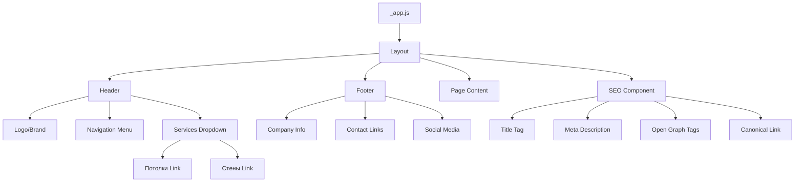

# Stretch Ceilings Landing Page - Component Architecture Design

## 1. Overview

### Project Context
This design document outlines the architecture and implementation strategy for developing core layout components of a stretch ceilings business landing page built with Next.js. The site showcases stretch ceiling and wall services with a multi-page structure.

### Purpose and Value
- Create a consistent, reusable layout structure across all pages
- Implement SEO-optimized metadata management for better search visibility
- Provide intuitive navigation with service-specific dropdown menus
- Establish a cohesive visual identity through typography and color system
- Enable Russian-language content presentation

### Scope
This design covers:
- Layout component orchestrating page structure
- Header with navigation and dropdown service menu
- Footer with company information and links
- SEO component for metadata management
- Global styling system (typography, colors, spacing)

### Technology Foundation
- **Framework**: Next.js 15.5.5 (Pages Router)
- **UI Library**: React 19.1.0
- **Styling**: CSS Modules
- **Language**: Russian (ru)
- **Font**: Gilroy typeface family

## 2. System Architecture

### Component Hierarchy



### Page Structure Flow

``mermaid
flowchart LR
    A[User Request] --> B{_app.js Entry}
    B --> C[Layout Wrapper]
    C --> D[SEO Injection]
    C --> E[Header Render]
    C --> F[Page Component]
    C --> G[Footer Render]
    
    D --> H[HTML Head]
    E --> I[Navigation]
    F --> J[Page-Specific Content]
    G --> K[Site Footer]
    
    I --> L[Services Dropdown Logic]
```

### Navigation Structure

| Page Level | Route | Display Name (RU) | Parent |
|------------|-------|-------------------|--------|
| Primary | `/` | Главная | - |
| Primary | `/about` | О нас | - |
| Parent Menu | `/services/*` | Услуги ▼ | - |
| Submenu | `/services/ceilings` | Потолки | Услуги |
| Submenu | `/services/walls` | Стены | Услуги |
| Primary | `/portfolio` | Портфолио | - |
| Primary | `/reviews` | Отзывы | - |
| Primary | `/faq` | FAQ | - |
| Primary | `/contacts` | Контакты | - |

## 3. Component Architecture

### 3.1 Layout Component

**Purpose**: Provide consistent page structure wrapper for all application pages

**Responsibilities**:
- Wrap all page content with common structure
- Manage SEO metadata injection
- Render persistent Header and Footer
- Handle page transitions and layout shifts
- Provide consistent spacing and container structure

**Props Interface**:

| Prop Name | Type | Required | Default | Description |
|-----------|------|----------|---------|-------------|
| children | React.ReactNode | Yes | - | Page content to render |
| title | string | No | - | Page-specific title for SEO |
| description | string | No | - | Page meta description |
| keywords | string | No | - | SEO keywords (optional) |
| ogImage | string | No | '/og-default.jpg' | Open Graph image URL |
| noIndex | boolean | No | false | Prevent search indexing |

**Component Structure**:

``mermaid
graph TD
    A[Layout Component] --> B[SEO Component]
    A --> C[Header Component]
    A --> D[Main Content Area]
    A --> E[Footer Component]
    
    B --> B1[Head Tags Injection]
    C --> C1[Site Navigation]
    D --> D1[Children Props]
    E --> E1[Footer Content]
```

**Behavior**:
- Accept page-specific metadata through props
- Pass metadata to SEO component
- Render Header at top of viewport
- Render main content area with semantic `<main>` tag
- Render Footer at bottom
- Apply consistent padding and max-width constraints

### 3.2 Header Component

**Purpose**: Provide site-wide navigation and branding

**Responsibilities**:
- Display company logo/brand
- Render primary navigation menu
- Implement dropdown menu for "Услуги" (Services)
- Handle mobile responsive navigation (hamburger menu)
- Manage active link highlighting
- Provide call-to-action elements (phone, contact button)

**Navigation Menu Structure**:

| Menu Item | Link Target | Type | Submenu Items |
|-----------|-------------|------|---------------|
| Главная | `/` | Direct Link | - |
| О нас | `/about` | Direct Link | - |
| Услуги | - | Dropdown Parent | Потолки, Стены |
| ↳ Потолки | `/services/ceilings` | Dropdown Item | - |
| ↳ Стены | `/services/walls` | Dropdown Item | - |
| Портфолио | `/portfolio` | Direct Link | - |
| Отзывы | `/reviews` | Direct Link | - |
| FAQ | `/faq` | Direct Link | - |
| Контакты | `/contacts` | Direct Link | - |

**Component States**:

``mermaid
stateDiagram-v2
    [*] --> Default
    Default --> ServicesOpen: Hover/Click on "Услуги"
    ServicesOpen --> Default: Mouse Leave / Click Outside
    Default --> MobileMenuOpen: Click Hamburger Icon
    MobileMenuOpen --> Default: Click Close / Navigate
    MobileMenuOpen --> ServicesExpanded: Click "Услуги"
    ServicesExpanded --> MobileMenuOpen: Click "Услуги" Again
```

**Interactive Elements**:

| Element | Desktop Behavior | Mobile Behavior |
|---------|-----------------|-----------------|
| Logo | Link to homepage | Link to homepage |
| Nav Link | Underline on hover, bold when active | Full-width touch target |
| Services Menu | Dropdown on hover/click | Expand/collapse accordion |
| CTA Button | Color change on hover | Full-width touch target |
| Phone Link | Hover effect | Direct call initiation |

**Visual Specifications** (Based on Figma design):

| Element | Property | Value |
|---------|----------|-------|
| Header Height | Desktop | 80-100px |
| Header Height | Mobile | 60-70px |
| Background | Color | White / Transparent with blur |
| Position | Type | Sticky / Fixed |
| Logo | Max Width | 150-200px |
| Navigation Font | Size | 16px |
| Navigation Font | Weight | 500 (Medium) |
| Dropdown Shadow | Box Shadow | 0 4px 12px rgba(0,0,0,0.1) |

### 3.3 Footer Component

**Purpose**: Provide site-wide footer with company information and secondary navigation

**Responsibilities**:
- Display company name and tagline
- Show contact information (address, phone, email)
- Render social media links
- Display copyright notice
- Provide secondary navigation links
- Show business hours or additional info

**Content Structure**:

| Section | Content Type | Elements |
|---------|-------------|----------|
| Company Info | Text Block | Company name, tagline, brief description |
| Navigation | Link List | Primary page links (duplicate of header) |
| Contact Info | Contact Details | Address, phone, email, working hours |
| Social Media | Icon Links | Instagram, VK, WhatsApp, Telegram |
| Legal | Text | Copyright, Privacy Policy, Terms |

**Layout Pattern**:

``mermaid
graph LR
    A[Footer Container] --> B[Column 1: Company]
    A --> C[Column 2: Navigation]
    A --> D[Column 3: Services]
    A --> E[Column 4: Contacts]
    
    F[Bottom Bar] --> G[Copyright]
    F --> H[Legal Links]
```

**Responsive Behavior**:

| Viewport | Layout | Columns |
|----------|--------|---------|
| Desktop (>1024px) | 4-column grid | Side by side |
| Tablet (768-1024px) | 2-column grid | 2×2 arrangement |
| Mobile (<768px) | Single column | Stacked vertically |

### 3.4 SEO Component

**Purpose**: Manage all page-level SEO metadata and Open Graph tags

**Responsibilities**:
- Inject `<title>` tag with site name suffix
- Add meta description tag
- Add meta keywords (optional)
- Generate Open Graph tags for social sharing
- Add Twitter Card metadata
- Inject canonical URL
- Control indexing with robots meta tag
- Add structured data (Schema.org) if applicable

**Props Interface**:

| Prop Name | Type | Required | Default | Description |
|-----------|------|----------|---------|-------------|
| title | string | Yes | - | Page title (will append site name) |
| description | string | Yes | - | Page meta description (150-160 chars) |
| keywords | string | No | - | Comma-separated keywords |
| ogImage | string | No | '/og-default.jpg' | Open Graph image URL (1200×630px) |
| ogType | string | No | 'website' | Open Graph type (website/article) |
| canonicalUrl | string | No | current URL | Canonical URL for duplicate content |
| noIndex | boolean | No | false | If true, adds noindex,nofollow |

**Generated Tags Structure**:

| Tag Category | Tag Name | Value Source | Example |
|--------------|----------|--------------|---------|
| Basic | `<title>` | `{title} - {siteName}` | "Натяжные потолки - СтретчПотолки" |
| Basic | meta description | description prop | "Качественные натяжные потолки..." |
| Basic | meta keywords | keywords prop | "натяжные потолки, установка..." |
| Robots | meta robots | Based on noIndex | "index, follow" |
| Canonical | link rel="canonical" | canonicalUrl | "https://site.ru/services/ceilings" |
| Open Graph | og:title | title | "Натяжные потолки" |
| Open Graph | og:description | description | "Качественные натяжные потолки..." |
| Open Graph | og:image | ogImage | "https://site.ru/og-default.jpg" |
| Open Graph | og:url | canonicalUrl | "https://site.ru/services/ceilings" |
| Open Graph | og:type | ogType | "website" |
| Open Graph | og:locale | "ru_RU" | Fixed value for Russian |
| Twitter | twitter:card | "summary_large_image" | Fixed value |
| Twitter | twitter:title | title | "Натяжные потолки" |
| Twitter | twitter:description | description | "Качественные натяжные потолки..." |
| Twitter | twitter:image | ogImage | "https://site.ru/og-default.jpg" |

**Implementation Pattern**:

``mermaid
graph TD
    A[Page Component] -->|Passes Props| B[Layout Component]
    B -->|Forwards Props| C[SEO Component]
    C --> D{Validate Props}
    D -->|Valid| E[Generate Tags]
    D -->|Missing Required| F[Use Defaults]
    E --> G[Inject into next/head]
    F --> G
    G --> H[Render in HTML Head]
```

**SEO Best Practices Applied**:

| Practice | Implementation |
|----------|----------------|
| Unique Titles | Each page passes unique title prop |
| Title Length | Limit to 50-60 characters |
| Description Length | Limit to 150-160 characters |
| Image Optimization | OG images at 1200×630px, <1MB |
| Canonical URLs | Always include to prevent duplicate content |
| Language Declaration | og:locale set to ru_RU |
| Structured Data | Consider adding JSON-LD for business info |

## 4. Global Styling System

### 4.1 Typography

**Font Family: Gilroy**

**Implementation Strategy**:
- Primary approach: Local font files (WOFF2 format) for performance
- Fallback: Sans-serif system fonts
- Font loading: CSS @font-face with font-display: swap

**Font Files Required**:

| Font Variant | Weight | Style | File Name | Usage |
|--------------|--------|-------|-----------|-------|
| Gilroy Light | 300 | Normal | gilroy-light.woff2 | Captions, subtle text |
| Gilroy Regular | 400 | Normal | gilroy-regular.woff2 | Body text, paragraphs |
| Gilroy Medium | 500 | Normal | gilroy-medium.woff2 | Navigation, buttons |
| Gilroy SemiBold | 600 | Normal | gilroy-semibold.woff2 | Subheadings, emphasis |
| Gilroy Bold | 700 | Normal | gilroy-bold.woff2 | Headings, CTAs |
| Gilroy ExtraBold | 800 | Normal | gilroy-extrabold.woff2 | Hero titles, impact text |

**Typography Scale**:

| Element | Font Size | Line Height | Font Weight | Usage Context |
|---------|-----------|-------------|-------------|---------------|
| H1 | 48-64px | 1.2 | 700-800 | Page hero titles |
| H2 | 36-48px | 1.3 | 700 | Section headings |
| H3 | 28-36px | 1.4 | 600 | Subsection headings |
| H4 | 24-28px | 1.4 | 600 | Card titles |
| H5 | 20-24px | 1.5 | 500 | Small headings |
| Body Large | 18-20px | 1.6 | 400 | Lead paragraphs |
| Body | 16px | 1.6 | 400 | Regular text |
| Body Small | 14px | 1.5 | 400 | Captions, meta info |
| Button | 16px | 1.2 | 500-600 | CTAs, buttons |
| Navigation | 16px | 1.2 | 500 | Menu links |

**Responsive Typography**:

| Breakpoint | Base Font Size | H1 Size | H2 Size |
|------------|----------------|---------|---------|
| Mobile (<768px) | 14px | 32-40px | 28-32px |
| Tablet (768-1024px) | 15px | 40-48px | 32-40px |
| Desktop (>1024px) | 16px | 48-64px | 36-48px |

### 4.2 Color System

**Primary Color Palette** (To be derived from Figma):

| Color Name | Purpose | Usage |
|------------|---------|-------|
| Primary | Brand color, CTAs | Buttons, links, active states |
| Primary Dark | Hover states, emphasis | Button hover, active navigation |
| Primary Light | Backgrounds, subtle accents | Highlights, badges |
| Secondary | Accent color | Secondary buttons, icons |
| Neutral Dark | Text, headings | Main text color |
| Neutral | Body text | Paragraph text |
| Neutral Light | Borders, dividers | Lines, separators |
| Neutral Lighter | Backgrounds | Section backgrounds |
| Background | Page background | Main page color |
| White | Text on dark, cards | Overlays, cards |
| Success | Positive feedback | Success messages |
| Warning | Alerts | Warning notifications |
| Error | Error states | Form errors |

**Color Variable Structure**:

| CSS Variable | Typical Value | Usage |
|--------------|---------------|-------|
| --color-primary | #3498db (example) | Primary brand color |
| --color-primary-hover | #2980b9 | Primary hover state |
| --color-text-primary | #1a1a1a | Main text |
| --color-text-secondary | #6b6b6b | Secondary text |
| --color-border | #e0e0e0 | Borders, dividers |
| --color-background | #ffffff | Page background |
| --color-background-alt | #f8f9fa | Alternate sections |

### 4.3 Spacing System

**Grid and Container**:

| Element | Desktop | Tablet | Mobile |
|---------|---------|--------|--------|
| Max Container Width | 1200px | 100% | 100% |
| Container Padding | 40px | 32px | 20px |
| Section Padding Vertical | 80-120px | 60-80px | 40-60px |

**Spacing Scale** (Based on 8px base unit):

| Scale Name | Value | Usage |
|------------|-------|-------|
| xs | 4px | Tight spacing, icon gaps |
| sm | 8px | Small gaps between related elements |
| md | 16px | Standard spacing between elements |
| lg | 24px | Spacing between sections |
| xl | 32px | Large spacing between major sections |
| 2xl | 48px | Extra large spacing |
| 3xl | 64px | Section padding |
| 4xl | 80px | Large section padding |
| 5xl | 120px | Hero section padding |

**Responsive Spacing**:

| CSS Variable | Desktop | Tablet | Mobile |
|--------------|---------|--------|--------|
| --spacing-section | 80px | 60px | 40px |
| --spacing-element | 24px | 20px | 16px |
| --spacing-component | 16px | 12px | 8px |

### 4.4 Breakpoints

| Breakpoint Name | Min Width | Max Width | Target Devices |
|-----------------|-----------|-----------|----------------|
| Mobile Small | 0 | 479px | Small phones |
| Mobile | 480px | 767px | Standard phones |
| Tablet | 768px | 1023px | Tablets, small laptops |
| Desktop | 1024px | 1439px | Standard desktops |
| Desktop Large | 1440px | - | Large screens |

**Media Query Strategy**:
- Mobile-first approach: Base styles for mobile, progressively enhance for larger screens
- Use min-width media queries for responsive enhancements
- Avoid device-specific targeting; focus on content breakpoints

### 4.5 Global CSS Reset and Base Styles

**Reset Elements**:
- Remove default margins and padding from all elements
- Set box-sizing to border-box globally
- Normalize form elements and buttons
- Remove default list styles where appropriate
- Set consistent line-height for readability

**Base Element Styles**:

| Element | Style Properties |
|---------|------------------|
| html | font-size: 16px (base), scroll-behavior: smooth |
| body | font-family: Gilroy, font-weight: 400, color: text-primary |
| h1-h6 | margin-top: 0, appropriate margins, font-weight settings |
| p | margin-bottom: spacing scale, line-height: 1.6 |
| a | color: primary, text-decoration: none, hover effects |
| button | Reset browser styles, cursor: pointer |
| img | max-width: 100%, height: auto, display: block |
| ul, ol | Reset padding and margin when used in nav |

## 5. Component Integration Pattern

### _app.js Integration

**Purpose**: Centralize Layout wrapper for all pages

**Integration Flow**:

``mermaid
graph TD
    A[Next.js Routing] --> B[_app.js]
    B --> C{Determine Component}
    C --> D[Layout Component]
    D --> E[SEO Component]
    D --> F[Header Component]
    D --> G[Page Component]
    D --> H[Footer Component]
    
    G --> G1[index.js]
    G --> G2[about.js]
    G --> G3[services/ceilings.js]
    G --> G4[services/walls.js]
    G --> G5[Other pages]
```

**Implementation Approach**:
- Import Layout component in _app.js
- Wrap all page components with Layout
- Allow pages to pass SEO props through pageProps
- Maintain global state or context if needed
- Apply global styles from globals.css

### Page-Level Usage Pattern

**Standard Page Structure**:

Each page component should:
1. Export metadata configuration for SEO
2. Return pure content without layout concerns
3. Focus on page-specific functionality
4. Use semantic HTML structure

**Example Page Pattern**:

``mermaid
graph TD
    A[Page Component File] --> B[Export Page Metadata]
    A --> C[Define Page Component]
    
    B --> B1[title]
    B --> B2[description]
    B --> B3[keywords]
    B --> B4[ogImage]
    
    C --> C1[Return JSX Content]
    C1 --> C2[Page-specific sections]
    C1 --> C3[Components composition]
```

## 6. Accessibility Considerations

### Semantic HTML

| Element | Usage | Purpose |
|---------|-------|---------|
| `<header>` | Site header | Landmark for navigation |
| `<nav>` | Navigation menus | Identify navigation regions |
| `<main>` | Page content | Primary content landmark |
| `<footer>` | Site footer | Footer landmark |
| `<h1>-<h6>` | Headings | Hierarchical structure |
| `<button>` | Interactive actions | Keyboard accessible |
| `<a>` | Links | Navigation elements |

### ARIA Labels

| Component | ARIA Attribute | Purpose |
|-----------|----------------|---------|
| Navigation | aria-label="Основная навигация" | Describe nav purpose |
| Dropdown | aria-expanded | Indicate dropdown state |
| Mobile Menu | aria-label="Меню" | Label hamburger button |
| Footer Nav | aria-label="Вспомогательная навигация" | Distinguish from primary nav |
| Social Links | aria-label="[Platform name]" | Identify social icons |

### Keyboard Navigation

| Interaction | Requirement |
|-------------|-------------|
| Navigation Links | Accessible via Tab key |
| Dropdown Menu | Open with Enter/Space, close with Esc |
| Mobile Menu | Toggle with Enter/Space on button |
| Skip to Content | Provide skip link for screen readers |
| Focus Indicators | Visible outline on all interactive elements |

### Color Contrast

| Text Type | Minimum Contrast Ratio | Standard |
|-----------|------------------------|----------|
| Normal Text | 4.5:1 | WCAG AA |
| Large Text (18px+) | 3:1 | WCAG AA |
| Interactive Elements | 3:1 (against background) | WCAG AA |

## 7. Performance Optimization

### Font Loading Strategy

| Strategy | Implementation | Benefit |
|----------|----------------|---------|
| font-display: swap | Applied to @font-face | Prevent invisible text during load |
| Preload Critical Fonts | Use `<link rel="preload">` | Faster first render |
| Subset Fonts | Include only Cyrillic + Latin | Reduce file size |
| WOFF2 Format | Modern compression | Smallest file size |

### Image Optimization

| Technique | Implementation |
|-----------|----------------|
| Next.js Image Component | Use for all images to enable automatic optimization |
| Responsive Images | Provide multiple sizes via srcset |
| Lazy Loading | Load below-fold images on demand |
| WebP Format | Modern format with fallback |
| Proper Sizing | Specify width and height to prevent layout shift |

### CSS Optimization

| Technique | Benefit |
|-----------|---------|
| CSS Modules | Scoped styles, automatic code splitting |
| Critical CSS | Inline critical styles for above-fold content |
| Minimize Reflows | Use transform and opacity for animations |
| Avoid @import | Use native Next.js CSS imports |

### JavaScript Optimization

| Technique | Implementation |
|-----------|----------------|
| Component Lazy Loading | Use dynamic imports for heavy components |
| Code Splitting | Automatic with Next.js pages |
| Minimize Re-renders | Use React.memo where appropriate |
| Event Handler Optimization | Debounce/throttle scroll and resize events |

## 8. Testing Strategy

### Component Testing

| Test Type | Focus | Tools |
|-----------|-------|-------|
| Unit Tests | Individual component logic | Jest + React Testing Library |
| Integration Tests | Component interaction | React Testing Library |
| Accessibility Tests | ARIA, keyboard navigation | jest-axe |
| Visual Regression | UI consistency | Storybook + Chromatic |

### Test Scenarios

#### Layout Component
- Renders children correctly
- Passes SEO props to SEO component
- Includes Header and Footer
- Applies correct structure

#### Header Component
- Renders all navigation links
- Services dropdown opens/closes on interaction
- Mobile menu toggles correctly
- Active link highlighting works
- Keyboard navigation functions

#### Footer Component
- Renders all footer sections
- Links navigate correctly
- Social media links open in new tabs
- Responsive layout adapts correctly

#### SEO Component
- Generates all required meta tags
- Handles missing optional props gracefully
- Constructs proper canonical URLs
- Formats Open Graph tags correctly
- Applies noindex when specified

### Accessibility Testing

| Aspect | Test Method |
|--------|-------------|
| Keyboard Navigation | Manual testing, tab through all elements |
| Screen Reader | Test with NVDA/VoiceOver |
| Color Contrast | Automated testing with axe DevTools |
| Semantic HTML | Validate with HTML validator |
| ARIA Labels | Inspect with browser DevTools |

## 9. Browser Support

### Supported Browsers

| Browser | Minimum Version |
|---------|-----------------|
| Chrome | Last 2 versions |
| Firefox | Last 2 versions |
| Safari | Last 2 versions |
| Edge | Last 2 versions |
| Mobile Safari | iOS 12+ |
| Chrome Mobile | Last 2 versions |

### Polyfills and Fallbacks

| Feature | Fallback Strategy |
|---------|-------------------|
| CSS Grid | Flexbox fallback for older browsers |
| CSS Custom Properties | PostCSS plugin for static values |
| Modern JS Features | Next.js automatic transpilation |
| WebP Images | Automatic fallback to JPEG/PNG |

## 10. Implementation Phases

### Phase 1: Foundation Setup
**Objective**: Establish global styling system and base structure

**Tasks**:
1. Configure Gilroy font files and @font-face declarations
2. Define CSS custom properties for colors, spacing, typography
3. Implement global CSS reset and base styles
4. Set up responsive breakpoints
5. Test font rendering across browsers

**Deliverables**:
- Updated `globals.css` with complete styling system
- Font files in `/public/fonts/` directory
- Typography and color variables defined
- Responsive utilities established

### Phase 2: SEO Component
**Objective**: Create reusable SEO metadata management

**Tasks**:
1. Define SEO component props interface
2. Implement meta tag generation logic
3. Add Open Graph and Twitter Card support
4. Implement canonical URL handling
5. Add robots meta tag control
6. Test with various prop combinations

**Deliverables**:
- Functional `components/Seo.js`
- Comprehensive metadata generation
- Proper defaults for optional props

### Phase 3: Header Component
**Objective**: Implement responsive navigation with dropdown

**Tasks**:
1. Create header structure and layout
2. Implement primary navigation menu
3. Add Services dropdown functionality (hover and click)
4. Implement active link highlighting
5. Create mobile responsive menu (hamburger)
6. Add logo and CTA elements
7. Style according to Figma design
8. Test dropdown interaction and mobile menu
9. Verify keyboard navigation

**Deliverables**:
- Functional `components/Header/Header.js`
- Styled `components/Header/Header.module.css`
- Desktop and mobile navigation working
- Dropdown menu with proper states

### Phase 4: Footer Component
**Objective**: Create informational footer

**Tasks**:
1. Define footer content structure (4-column layout)
2. Implement company info section
3. Add navigation links section
4. Add services links section
5. Add contact information section
6. Implement responsive grid (4-col → 2-col → 1-col)
7. Add social media icons and links
8. Style according to Figma design
9. Test responsive behavior

**Deliverables**:
- Functional `components/Footer/Footer.js`
- Styled `components/Footer/Footer.module.css`
- Responsive multi-column layout
- All footer sections implemented

### Phase 5: Layout Component
**Objective**: Orchestrate page structure with all subcomponents

**Tasks**:
1. Define Layout component props interface
2. Import and integrate SEO, Header, Footer components
3. Implement main content area wrapper
4. Add proper semantic HTML structure
5. Apply container and spacing utilities
6. Create Layout.module.css for structural styles
7. Test with different prop combinations

**Deliverables**:
- Functional `components/Layout/Layout.js`
- Styled `components/Layout/Layout.module.css`
- Proper component composition
- Flexible props handling

### Phase 6: Integration
**Objective**: Connect Layout to all pages via _app.js

**Tasks**:
1. Update `_app.js` to wrap all pages with Layout
2. Update each page to pass appropriate SEO props
3. Remove boilerplate Head tags from individual pages
4. Test navigation across all pages
5. Verify SEO tags on each page
6. Test responsive behavior site-wide
7. Perform accessibility audit
8. Cross-browser testing

**Deliverables**:
- Updated `pages/_app.js` with Layout integration
- All pages updated with SEO metadata
- Consistent navigation and footer across site
- Verified responsive design
- Accessibility compliance verified

## 11. Design References

### Figma Design Specifications

**Source**: https://www.figma.com/design/KNz7qnaVE3zD1ECypz3XoK/Landing--Design?node-id=1-84

**Key Design Elements to Extract**:

| Design Element | What to Extract |
|----------------|-----------------|
| Header | Logo placement, navigation layout, colors, spacing, sticky behavior |
| Navigation | Link styles, hover states, active states, dropdown design |
| Typography | Font sizes, weights, line heights, letter spacing |
| Colors | Primary palette, secondary colors, text colors, background colors |
| Spacing | Section padding, element margins, grid gaps |
| Footer | Layout structure, content organization, link styles |
| Buttons/CTAs | Colors, sizes, border radius, hover effects |
| Responsive Breakpoints | Mobile, tablet, desktop layouts |
| Icons | Style (outline/filled), size, color |

### Content Requirements

**Russian Language Specifications**:

| Content Type | Language Requirement |
|--------------|---------------------|
| Navigation Labels | Russian (Cyrillic) |
| Page Titles | Russian |
| Meta Descriptions | Russian |
| Button Text | Russian |
| Footer Content | Russian |
| Alt Text | Russian |
| ARIA Labels | Russian |

**Site Name and Branding**:
- To be determined from Figma design
- Consistent across all pages
- Used in title suffix: "{Page Title} - {Site Name}"

## 12. Technical Constraints

### Next.js Pages Router Limitations

| Constraint | Impact | Mitigation |
|------------|--------|------------|
| No React Server Components | Cannot use async components | Use getStaticProps/getServerSideProps |
| File-based routing only | Route structure tied to files | Organize pages logically |
| Global CSS imports restricted | Can only import in _app.js | Use CSS Modules for components |

### CSS Modules Scoping

| Aspect | Consideration |
|--------|---------------|
| Class Name Scoping | Automatic scoping prevents conflicts |
| Global Styles | Use :global() selector sparingly |
| Composition | Use composes for reusability |
| JavaScript Access | Import styles as object |

### Performance Budgets

| Metric | Target | Measurement |
|--------|--------|-------------|
| First Contentful Paint | < 1.5s | Lighthouse |
| Largest Contentful Paint | < 2.5s | Lighthouse |
| Time to Interactive | < 3.5s | Lighthouse |
| Cumulative Layout Shift | < 0.1 | Lighthouse |
| Total Page Weight | < 1.5MB | Network tab |
| JavaScript Bundle | < 300KB | Next.js build output |

## 13. Maintenance and Extensibility

### Component Reusability

| Component | Reuse Potential | Extensibility |
|-----------|-----------------|---------------|
| Layout | High - wraps all pages | Can add sidebar, breadcrumbs |
| Header | High - appears everywhere | Can add search, user menu |
| Footer | High - appears everywhere | Can add newsletter, additional columns |
| SEO | High - used by all pages | Can add structured data, more meta tags |

### Future Enhancements

| Enhancement | Impact | Priority |
|-------------|--------|----------|
| Dark Mode Toggle | User preference support | Medium |
| Language Switcher | Multi-language support | Low |
| Search Functionality | Content discoverability | Medium |
| Breadcrumbs | Navigation aid | Medium |
| Sticky CTA Button | Lead generation | High |
| Live Chat Widget | Customer support | Medium |
| Cookie Consent Banner | GDPR compliance | High |
| Loading States | UX improvement | Low |

### Documentation Requirements

| Documentation Type | Purpose |
|--------------------|---------|
| Component API Docs | Document props, usage examples |
| Style Guide | Typography, colors, spacing reference |
| Accessibility Guidelines | WCAG compliance checklist |
| Content Guidelines | SEO best practices, content structure |
| Deployment Guide | Build and deploy procedures |


